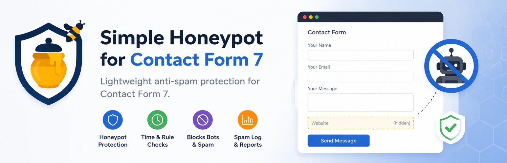
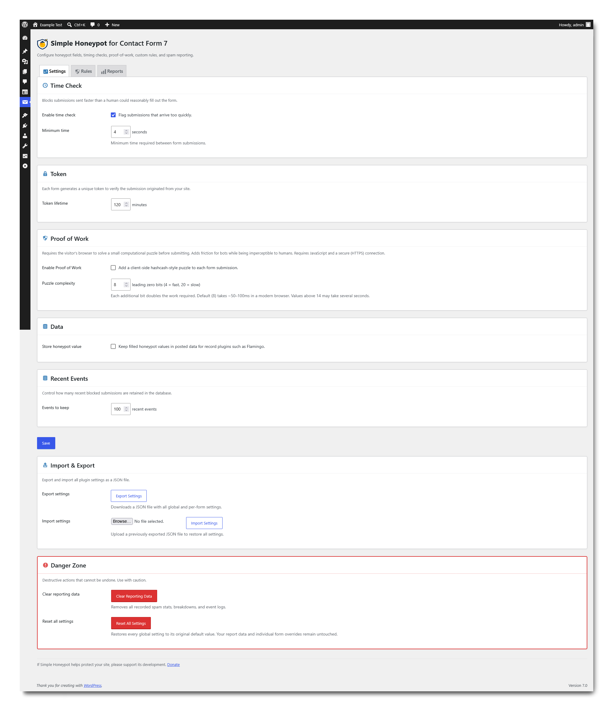
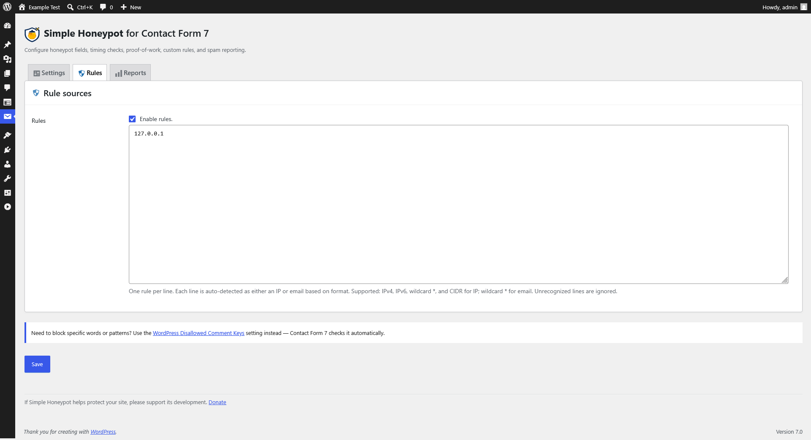
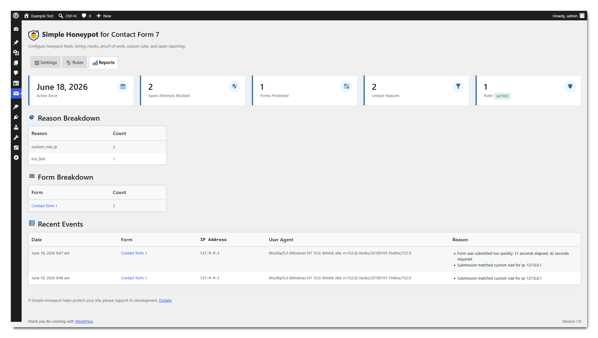
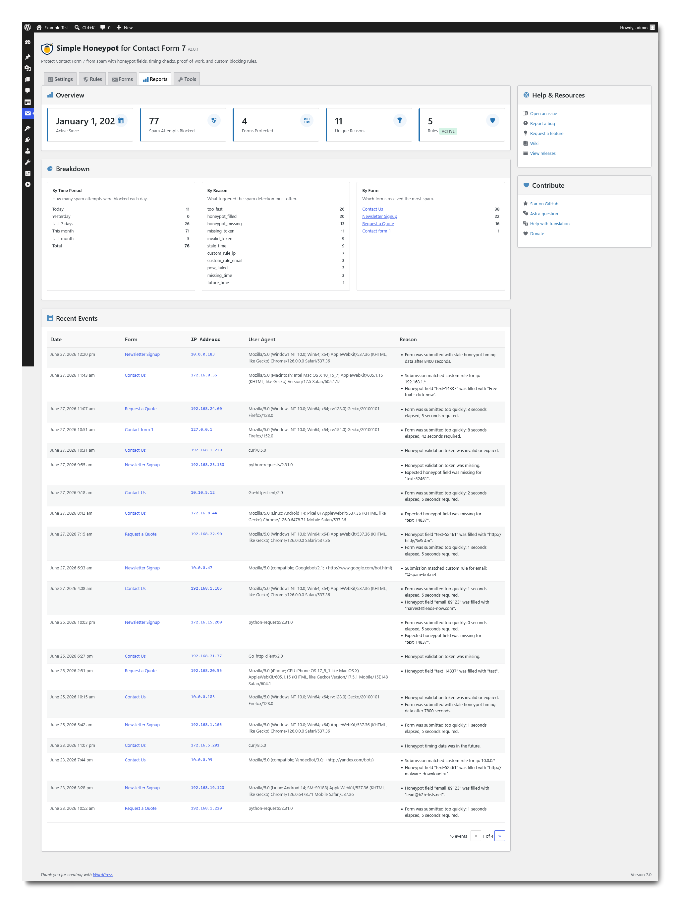
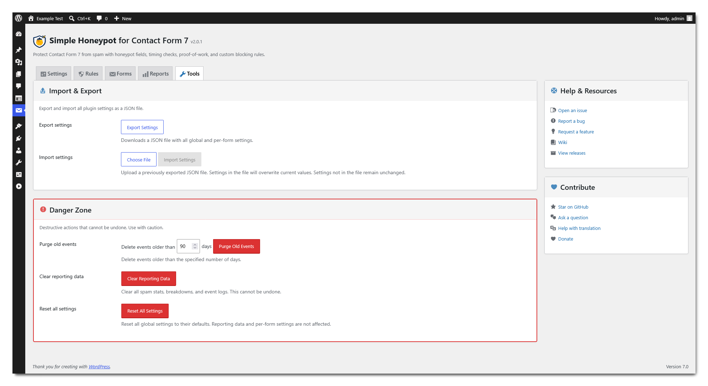

# Simple Honeypot for Contact Form 7

Lightweight honeypot, timing, proof-of-work, and rule-based spam protection for Contact Form 7.

    

    

| Property | Value |
|----------|-------|
| Contributors | pushpasta |
| Donate link | [https://github.com/pushpasta/simple-honeypot-cf7/?sponsor](https://github.com/pushpasta/simple-honeypot-cf7/?sponsor) |
| Tags | contact form 7, cf7, honeypot, antispam, spam protection, bot protection, proof of work, hashcash |
| Requires at least | 6.7 |
| Tested up to | 7.0 |
| Stable tag | 2.0.0 |
| Requires PHP | 7.4 |
| Requires Plugins | contact-form-7 |
| License | GNU GPLv3 |
| License URI | [https://www.gnu.org/licenses/gpl-3.0.html](https://www.gnu.org/licenses/gpl-3.0.html) |

## Description

Hidden honeypot fields, timing checks, proof-of-work, custom rules, and spam reporting for Contact Form 7. Everything runs on your server — no external services, no visitor tracking.

### Features

* 🪤 Adds a `[honeypot]` form tag to Contact Form 7, supporting multiple fields per form.
* 🔒 Server-side token validation — no database queries during validation.
* 🧩 Dynamic field names that change regularly, cache-friendly and harder for bots to predict.
* ⏱️ Timing checks flag submissions that arrive faster than a human could fill out the form.
* 🧠 Optional Proof-of-Work — browser solves a computational puzzle before submitting. Imperceptible to humans, costly for bots.
* 🛡️ IP and email blocking rules with wildcard and CIDR support.
* 🔐 All checks run locally — no external API calls, no visitor tracking, no data sharing.
* 🔁 Import and export all settings (global + per-form) as a single JSON file.
* 📝 Records blocked spam with form, IP, user agent, and reason details.
* 🧾 Adds spam log reasons to CF7 submissions for record-keeping plugins like Flamingo.

## Installation

### Manual Installation

1. Upload the `simple-honeypot-cf7` folder to `/wp-content/plugins/`.
2. Activate Simple Honeypot for Contact Form 7 from the Plugins screen.
3. Make sure Contact Form 7 is installed and active.
4. Add a `[honeypot]` field to a CF7 form.

## FAQ

How does the honeypot work?

The plugin adds one or more hidden fields that are invisible to legitimate visitors. Automated bots often fill these fields, allowing spam submissions to be identified and blocked before they are processed. You can add multiple honeypot fields to a single form.

What is Proof of Work and how does it help?

Proof of Work requires the visitor's browser to spend a small amount of CPU time computing a hash before the form can be submitted. At the default complexity, this takes roughly 50–100ms — imperceptible to humans — but forces automated spam tools to spend significant resources. It can be enabled or disabled in the settings with configurable difficulty. Requires JavaScript and a secure (HTTPS) connection.

Does the plugin block submissions that are sent too quickly?

Yes. The plugin validates the time between page load and form submission. Submissions that arrive faster than the configured minimum time are flagged as spam. Time checks can be inherited from global settings, enabled, or disabled per form.

What types of spam rules are supported?

The plugin supports IP addresses (with wildcards and CIDR) and email addresses (with wildcards). For keyword or pattern filtering, use the WordPress Disallowed Comment Keys setting (Settings → Discussion), which Contact Form 7 checks automatically.

Does the plugin send form data to a third-party service?

No. All spam checks are performed locally on your website. No form submissions or visitor data are sent to external services.

Will the honeypot value be stored in record plugins like Flamingo?

By default, honeypot fields are removed from submitted data before it is stored. You can optionally enable storage of honeypot values in the plugin settings (under Data) for debugging or security analysis.

Why was a submission marked as spam?

The Spam Log shows which rule triggered the detection, such as a filled honeypot field, a failed time check, a blocked keyword, or a custom IP or email rule.

What happens when the plugin is uninstalled?

All plugin data is removed from the database, including settings, statistics, and per-form configuration. The only exception is spam submissions already recorded in the log, which are preserved.

## Screenshots

### General Settings

Configure timing threshold, token lifetime, proof-of-work complexity, and data retention.

### Rules

Create IP or email rules to block specific addresses or patterns.

### Reports

View blocked submission statistics with reason and form breakdowns.

### Form Settings

Override time-check settings on a per-form basis.

### Spam Log

Review detailed records of each blocked submission, including reason, IP, and user agent.

## Changelog

### 2.0.0

### Added
* Events table pagination with configurable per-page setting.
* Dynamic confirm dialog with danger styling and countdown.
* Tools tab for import, export, and danger zone actions.
* Blocked spam summary in sidebar.
* Import with dialog confirmation and file upload styled as button.
* Sidebar with help and contribute links.
* Unified admin notice system with icons and colors.
* Import button disabled until file selected.
* Purge events notice with count.
* Custom events table for better performance.
* Auto-delete and manual purge for old events.
* Rules normalization and validation on save.
* Reset to defaults button in CF7 panel.

### Fixed
* Correct events pagination link.
* Improve confirm dialogs and importer validation.
* Preserve current settings on import.

### 1.3.0

### Added
* Display plugin version with tooltip in admin footer.
* Auto-link bare URLs in plugin description.
* Add shared Request helper for form submission handling.
* Add performance caches for spam checker.
* Consolidate rules sanitization with soft-limit warning.
* Add confirm dialog and client validation for settings.
* Add forms overview tab with per-form settings display.

### Fixed
* Prevent button values and CF7 meta fields from leaking into posted_data.
* Unify Count translator comment to resolve pot warning.
* Correct text domains and add translator comments.

### 1.2.2

### Fixed
* Prevent http prefix on AbuseIPDB IP links in admin UI.

### 1.2.1

### Fixed
* Include compatibility fields in update transient for WordPress core version checks.

### 1.2.0

### Added
* Link IP addresses to AbuseIPDB in the reports table for quick threat lookups.

### Fixed
* Prevent duplicate tokens from bypassing honeypot validation.
* Reject malformed CIDR rules that could match all IPs.
* Preserve IP and email prefixes in rule sanitization.
* Improve Markdown rendering and sanitize link protocols in plugin details.
* Cache token validation to avoid duplicate HMAC computation.
* Include max_age in Token::validate() return array.
* Use byte count for str_pad in CIDR mask padding.
* Add return after redirect() calls for defensive coding.
* Check submission time once per form, not per token.

### 1.1.1

### Fixed
* Resolved phantom update notices persisting after a successful plugin update.

### 1.1.0

### Added
* Auto-update support for the plugin.
* Auto-update toggle in the third-party plugin interface.
* Plugin banner display in the update details modal.
* Basic Markdown formatting support in the plugin details modal.

### Fixed
* Resolved filesystem errors that could occur during plugin updates.
* Improved handling of WordPress auto-update preferences.
* Cleaned up auto-update settings during plugin uninstall.

### 1.0.0
* Initial release.

## Upgrade Notice

### 2.0.0
* Major update with new Tools tab, events pagination, improved UI, and better spam management. Recommended update for all users.

### 1.3.0
* New features including version display, forms overview, and improved spam rules. Recommended update for all users.

### 1.2.2
* Recommended update. Fixes IP address links in the reports table.

### 1.2.1
* Fixes compatibility fields in the update transient for WordPress core version checks. Recommended for all users.

### 1.2.0
* Security and reliability fixes for token validation and CIDR rule handling. Adds AbuseIPDB links in reports. Recommended for all users.

### 1.1.1
* Fixes a bug where the update notice would persist after a successful update. Recommended for all users.

### 1.1.0
* Adds auto-update support, plugin banners in the update modal, and fixes updater errors. Recommended update for all users.

### 1.0.0
* Initial release.
