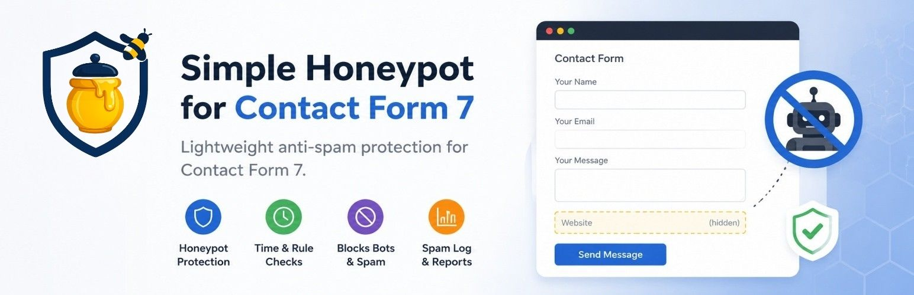
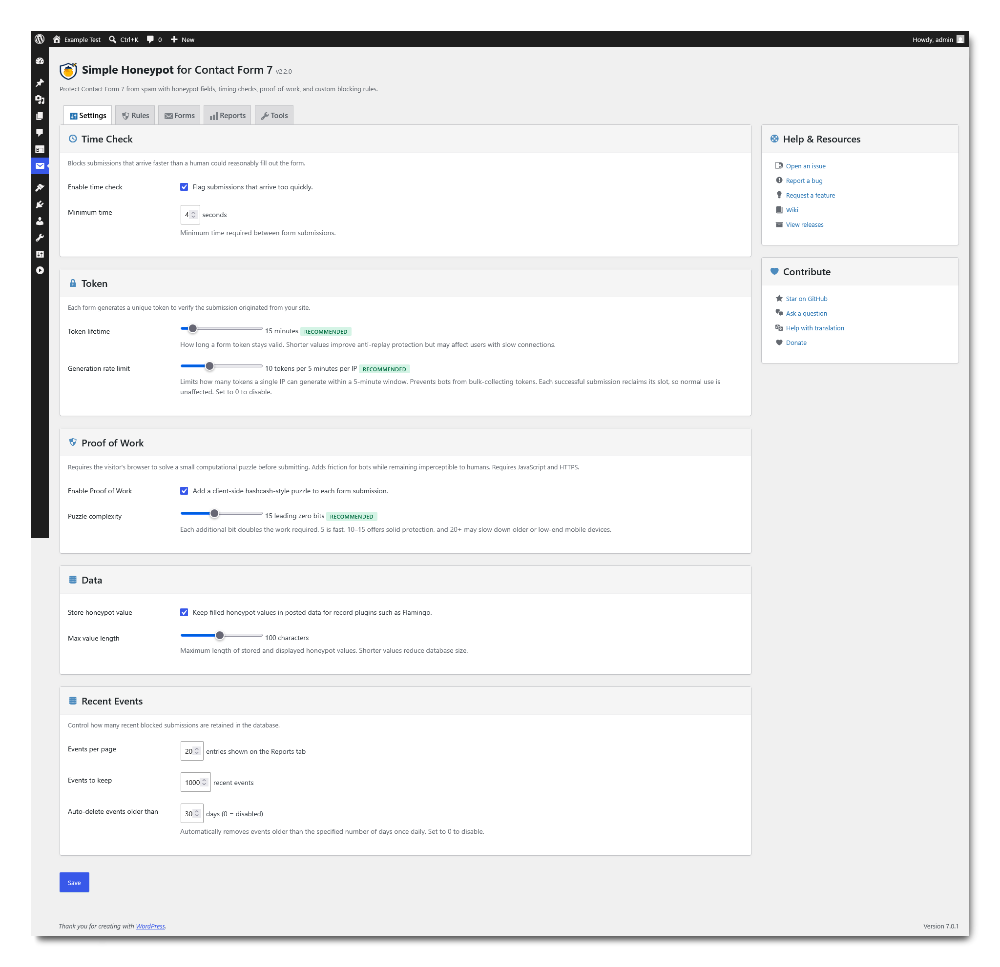
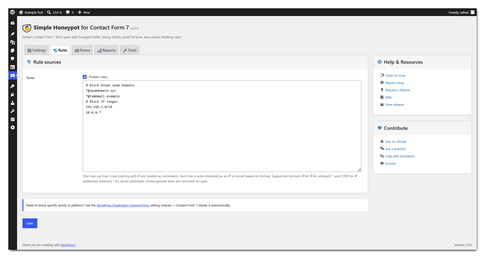
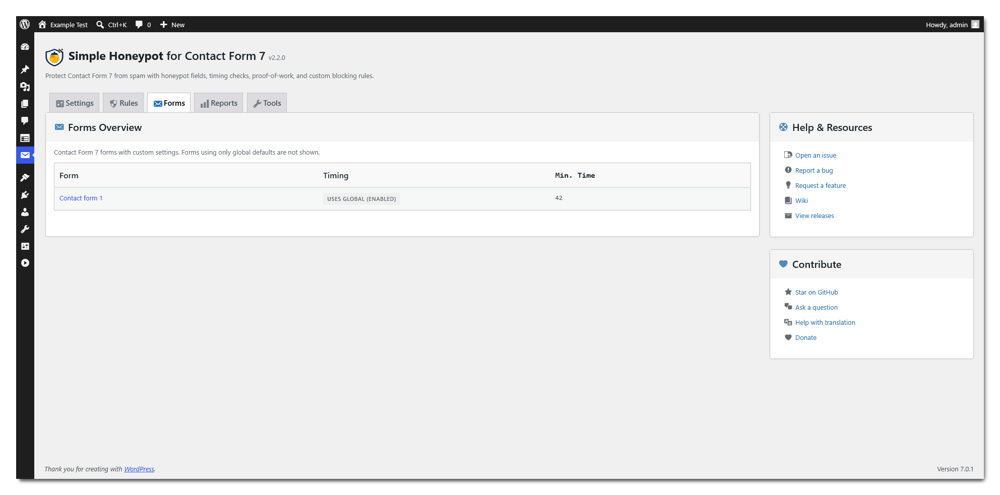
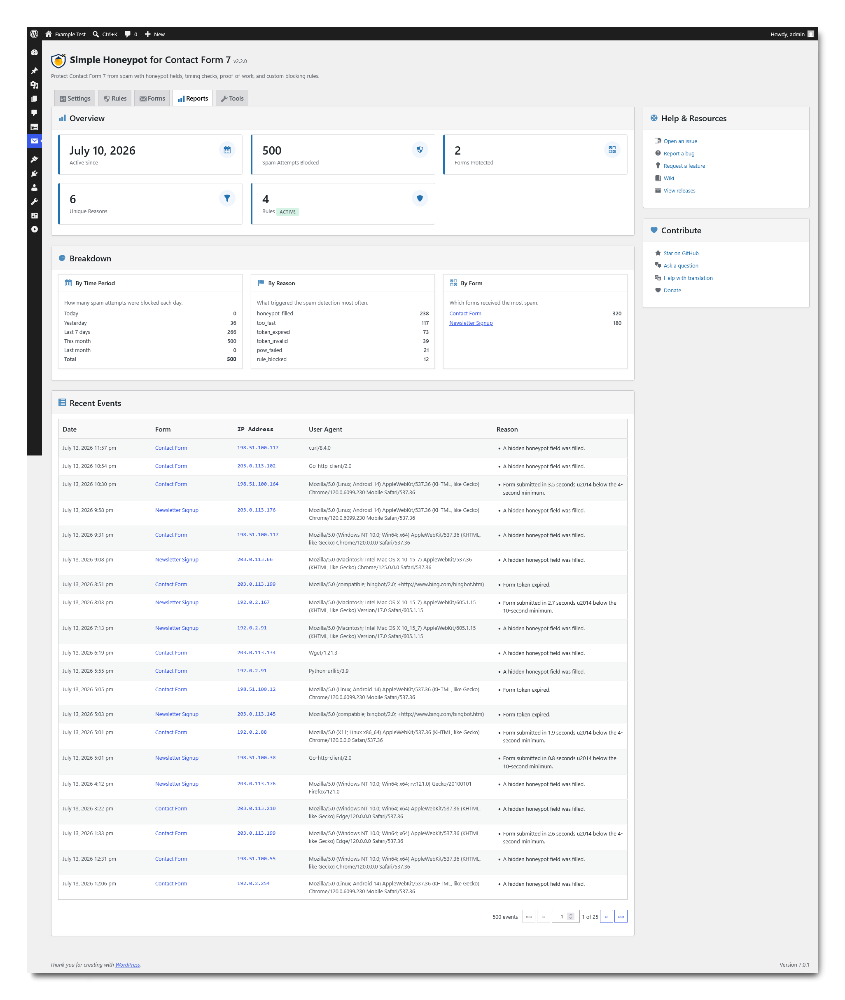
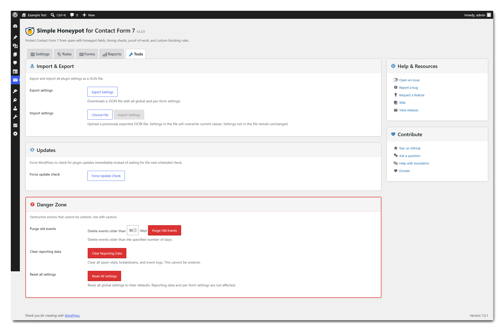
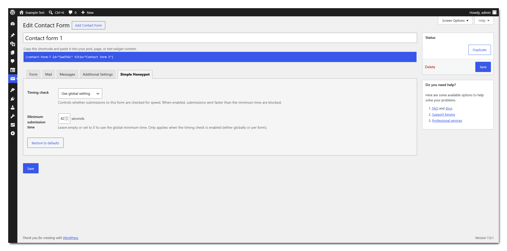
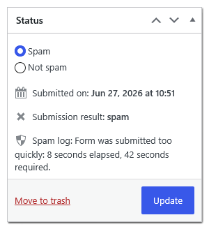

# Simple Honeypot for Contact Form 7

Lightweight honeypot, timing, proof-of-work, and rule-based spam protection for Contact Form 7.

    

    

| Property | Value |
|----------|-------|
| Contributors | pushpasta |
| Donate link | [https://github.com/pushpasta/simple-honeypot-cf7/?sponsor](https://github.com/pushpasta/simple-honeypot-cf7/?sponsor) |
| Tags | contact form 7, cf7, honeypot, antispam, spam protection, bot protection, proof of work, hashcash |
| Requires at least | 6.7 |
| Tested up to | 7.1 |
| Stable tag | 3.2.1 |
| Requires PHP | 7.4 |
| Requires Plugins | contact-form-7 |
| License | GNU GPLv3 |
| License URI | [https://www.gnu.org/licenses/gpl-3.0.html](https://www.gnu.org/licenses/gpl-3.0.html) |

## Description

Hidden honeypot fields, timing checks, proof-of-work, custom rules, and spam reporting for Contact Form 7. Everything runs on your server — no external services, no visitor tracking. <strong>Requires JavaScript</strong> in the browser.

### Features

* 🪤 Adds a `[honeypot]` form tag to Contact Form 7, supporting multiple fields per form.
* ✅ Forms without `[honeypot]` fields continue working as normal — the plugin does not interfere.
* 🔒 Server-side token validation — no database queries during validation.
* 🧩 Dynamic field names that change regularly, cache-friendly and harder for bots to predict.
* ⏱️ Timing checks flag submissions that arrive faster than a human could fill out the form.
* 🧠 Optional Proof-of-Work — browser solves a computational puzzle before submitting. Imperceptible to humans, costly for bots.
* 🛡️ IP and email blocking rules with wildcard and CIDR support.
* 🔐 All checks run locally — no external API calls, no visitor tracking, no data sharing.
* 🔁 Import and export all settings (global + per-form) as a single JSON file.
* 📝 Records blocked spam with form, IP, user agent, and reason details.
* 🧾 Adds spam log reasons to CF7 submissions for record-keeping plugins like Flamingo.

## Installation

### Manual Installation

1. Upload the `simple-honeypot-cf7` folder to `/wp-content/plugins/`.
2. Activate Simple Honeypot for Contact Form 7 from the Plugins screen.
3. Make sure Contact Form 7 is installed and active.
4. Add a `[honeypot]` field to a CF7 form.

## FAQ

How does the honeypot work?

The plugin adds one or more hidden fields that are invisible to legitimate visitors. Automated bots often fill these fields, allowing spam submissions to be identified and blocked before they are processed. You can add multiple honeypot fields to a single form.

What is Proof of Work and how does it help?

Proof of Work requires the visitor's browser to spend a small amount of CPU time computing a hash before the form can be submitted. At the default complexity, this takes roughly 50–100ms — imperceptible to humans — but forces automated spam tools to spend significant resources. It can be enabled or disabled in the settings with configurable difficulty. Requires a secure (HTTPS) connection.

Why does the plugin require JavaScript?

The plugin uses JavaScript to fetch anti-spam tokens and solve proof-of-work puzzles directly in the browser. This approach is fully compatible with full-page caching solutions and ensures tokens are always fresh. Visitors with JavaScript disabled will be unable to submit protected forms.

Does the plugin block submissions that are sent too quickly?

Yes. The plugin validates the time between page load and form submission. Submissions that arrive faster than the configured minimum time are flagged as spam. Time checks can be inherited from global settings, enabled, or disabled per form.

What types of spam rules are supported?

The plugin supports IP addresses (with wildcards and CIDR) and email addresses (with wildcards). For keyword or pattern filtering, use the WordPress Disallowed Comment Keys setting (Settings → Discussion), which Contact Form 7 checks automatically.

Does the plugin send form data to a third-party service?

No. All spam checks are performed locally on your website. No form submissions or visitor data are sent to external services.

Will the honeypot value be stored in record plugins like Flamingo?

By default, honeypot fields are removed from submitted data before it is stored. You can optionally enable storage of honeypot values in the plugin settings (under Data) for debugging or security analysis.

Why was a submission marked as spam?

The Spam Log shows which rule triggered the detection, such as a filled honeypot field, a failed time check, a blocked keyword, or a custom IP or email rule.

Are existing forms without honeypots affected?

No. The plugin only runs on forms that include at least one `[honeypot]` tag. All other CF7 forms keep working exactly as before.

What happens when the plugin is uninstalled?

All plugin data is removed from the database, including settings, statistics, and per-form configuration. The only exception is spam submissions already recorded in the log, which are preserved.

## Screenshots

### Settings

Configure timing threshold, token lifetime, proof-of-work complexity, data retention, and event limits.

### Rules

Create IP or email rules with wildcard and CIDR support to block specific addresses or patterns.

### Forms

Overview of forms with custom per-form settings, showing timing mode and minimum time at a glance.

### Reports

View blocked submission statistics with breakdowns by time period, reason, and form.

### Tools

Import and export all settings as JSON, or manage data with purge, clear, and reset actions.

### Per-Form Settings

Override global timing and honeypot settings on a per-form basis inside the Contact Form 7 editor.

### Spam Status

Detection reason and details recorded for each blocked submission, visible in record-keeping plugins like Flamingo.

## Changelog

Full changelog for all versions is in changelog.txt.

### 3.2.1

### Fixed
* "By Reason" breakdown was empty after upgrading from pre-3.2.0 because the v4 migration discarded historical reason data. A new migration now rebuilds per-form reason counts from the events table.

### 3.2.0

### Added
* Site URL check when importing settings — imports warn when the file was exported from another site.
* Settings exports now include an export timestamp and site URL.
* "Recalculate Stats" button in the sidebar refreshes report totals on demand.

### Changed
* Spam statistics now store counters per form instead of a shared database table; existing data is migrated automatically.
* Reports "By Time" figures come from the cached summary instead of live database queries on every page view.
* Imports validate every value against the settings schema; keys missing from the file keep their current values instead of resetting to defaults.
* Per-form overrides are only imported for forms that already have stored settings.
* "By Time Period" box renamed to "By Time" with polished breakdown cards.
* Tested up to WordPress 7.1.
* Removed the version tooltip from the admin header.

### Fixed
* Migration keeps statistics only for forms that still exist, drops orphan aggregates, and schedules the hourly stats cron.
* Purging events refreshes report totals immediately instead of waiting for the hourly cron.
* Import aborts safely when the site URL check is ticked but the file contains no site URL.
* Import rejects files without a version number or exported by a newer plugin version.
* Pre-3.2.0 export formats are normalized on import.
* Strong tags in import error messages and confirm dialogs render correctly.
* Uninstall removes leftover site transients on single-site installs.

## Upgrade Notice

### 3.2.1
* Fixes the "By Reason" report section being empty after upgrading to 3.2.0. Historical reason data is automatically restored from the event log. Recommended update for all users on 3.2.0.
